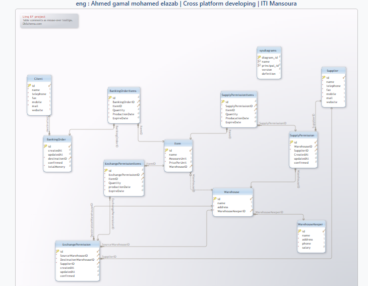
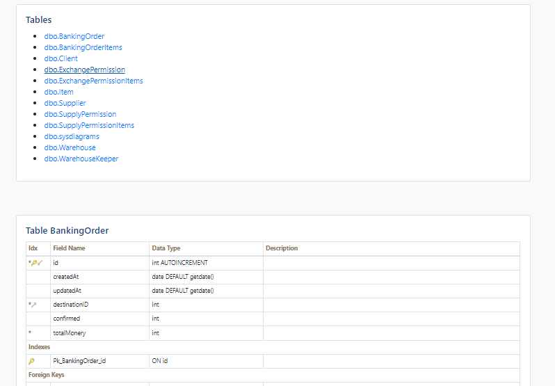
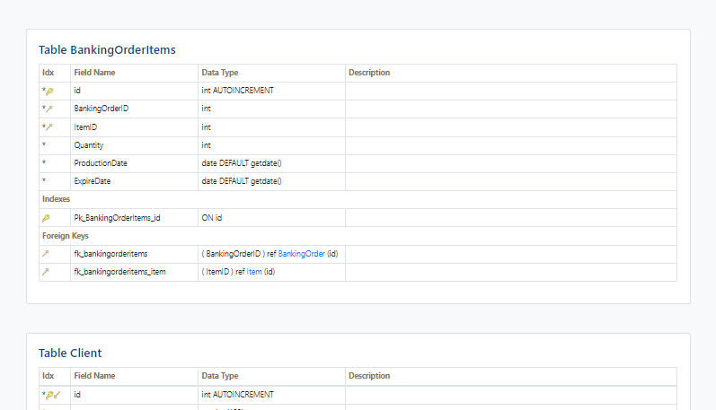

# Warehouse management system : 
* system accept adding new warehouse . 
* system accept connect warehouse with warehouse keeper .
* system can manage the warehouse and the items .
* you can create suppliers and clients . 
* supplier can fill the warehouse with his items .
* system can assign for any client Banking order permission .

# Demo : 

# DataBase documentation Samples : 

# Entity framework models : 

# Not implemented : 

* some CRUD operations not implemented . 
* some ui onUpdate handling state . 
